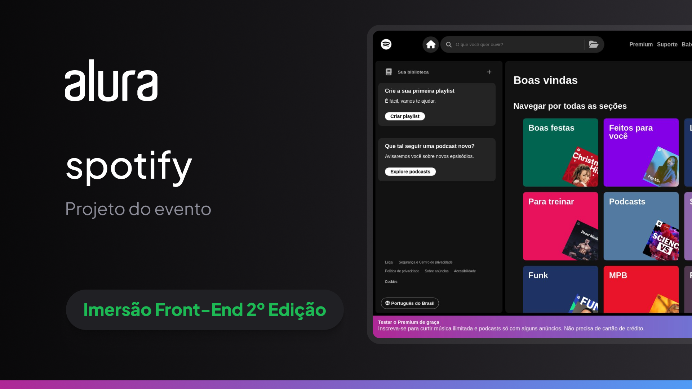

# Imersão Front-End 2º Edição da Alura.

 Esse é o projeto é um clone do Spotify utilizando HTML, CSS, JavaScript e React.

## Tecnologias Utilizadas

- [HTML](https://developer.mozilla.org/HTML)
- [CSS](https://developer.mozilla.org/CSS)
- [JavaScript](https://developer.mozilla.org/pt-BR/docs/Web/JavaScript)
- [React](https://react.dev)
